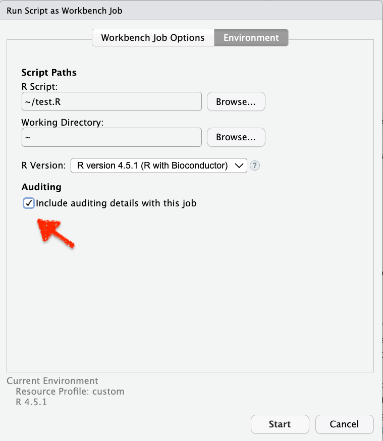
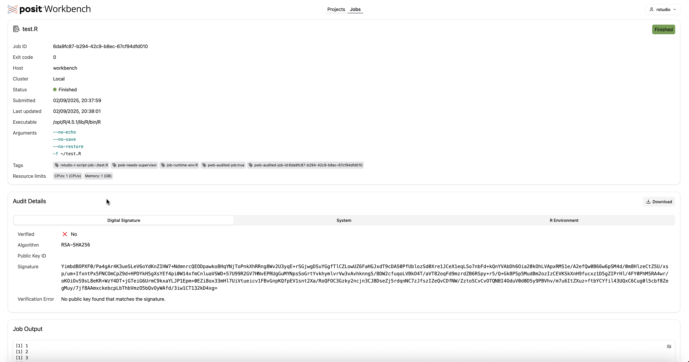
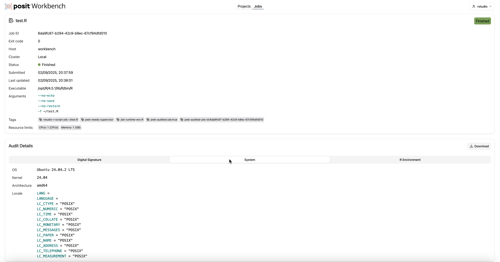
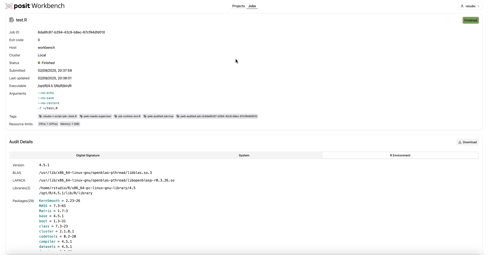

# Audited Jobs

This folder contains a sample Posit Workbench setup that will allow you to explore the audited jobs feature. 

## Introduction

[Audited Jobs](https://docs.posit.co/ide/server-pro/admin/auditing_and_monitoring/audited_workbench_jobs.html) is a new feature implemented into Workbench jobs. It allows the execution of your code in a controlled manner with audit logs cryptographically signed  and stored in a safe location. The audit information at this point contains output and environment information. 

The feature is in preview mode. This means that we are still actively devloping it and looking forward to any feedback or suggestion on how to further improve this feature. 

At this point in time this feature does NOT comprise a full audit trail but it can be developed into such an audit trail over time. 

## Environment setup

The environment is using `docker-compose`.

As a requirement, you need a valids Posit Workbench license key, stored in an environment variable called `RSP_LICENSE`. 

In order to launch this environment, you will only need to run 

```
docker-compose up -d
```

which will build a docker container and eventually launch Posit Workbench. Once the container is started, you will be able to connect to workbench at http://localhost:8787. Username and password are `rstudio`. 

Given that Workbench jobs are only available in RStudio IDE or in VS Code / Positron, please make sure you use these IDE's for your testing. 


## Example

Let's say you launch the RStudio IDE. You develop a code there and want to run it agains the audited jobs feature. You then would launch a workbench job and tick the box as shown below. 



Once the job is run, you can click on the job details


after which you get an overview page with the below three tabs

* Digital signature and output 
* System details
* R Environment details



